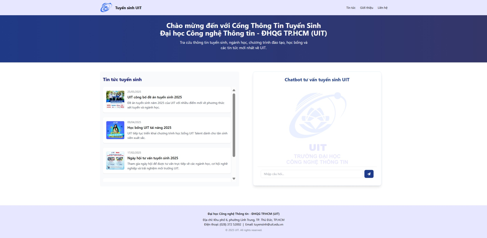

# Admissions Chatbot for UIT – VNUHCM

A retrieval-augmented generation (RAG) chatbot designed to assist prospective students with university admissions inquiries for the University of Information Technology - Vietnam National University Ho Chi Minh City.

---



## Project Overview

This application uses natural language processing and knowledge retrieval to provide information about university admissions. The chatbot collects data from UIT's official website, processes it, and answers user queries based on that data.

### Key Features

- Two main branches for information retrieval:
  - **main** (also `hybrid_search_bm25`): Combines BM25 score and semantic score for hybrid search.
  - **hard-filter**: Uses hard metadata filtering (with hand-crafted keywords, suitable for admissions) and semantic score only.
- Utilizes Google Cloud API for large language model (LLM) responses  
- Processes documents with chunking and keyword filtering  
- Web-based interface 

---

## System Architecture

The project has separate frontend and backend components:

### Backend

- Framework: Django REST Framework  
- Database: PostgreSQL (Neon)  
- Vector database: Qdrant for semantic search  
- NLP processing:  
  - LangChain SemanticChunker for chunking  
  - Sentence Transformer [AITeamVN/Vietnamese_Embedding](https://huggingface.co/AITeamVN/Vietnamese_Embedding) from Hugging Face for embeddings  
  - Custom keyword filtering  

### Frontend

- Framework: React with TypeScript  
- UI: Custom chat interface  
- State management: React hooks  

---

## Installation & Setup
### Backend Setup

```bash
git clone https://github.com/hnd1908/chatbot_uni.git
cd chatbot_uni

python -m venv venv
# On Linux/macOS:
source venv/bin/activate
# On Windows:
venv\Scripts\activate

pip install -r requirements.txt

cd backend
# Create a .env file in backend directory with necessary variables
python manage.py migrate
python manage.py runserver
```

### Frontend Setup

```bash
cd frontend
npm install
npm run dev
```

### Project Structure
```bash
chatbot_uni/
├── backend/              # Django backend
│   ├── chatbot/          # Main Django app
│   └── chatbot_api/      # REST API implementation
├── frontend/             # React frontend
│   └── src/
│       ├── assets/       # Static assets
│       ├── components/   # React components
│       │   ├── Chatbox.tsx
│       │   ├── Navbar.tsx
│       │   └── Sidebar.tsx
│       └── pages/        # Page components
│           ├── Chat.tsx
│           ├── Home.tsx
│           └── Login.tsx
├── rag/                  # RAG system implementation
│   ├── cleaned_data/     # Processed data
│   ├── csv_data/         # CSV format data
│   ├── markdown_data/    # Markdown content
│   ├── chunking.py       # Document chunking logic
│   ├── clean_markdown.py # Markdown processing
│   ├── crawler.py        # Web crawler for data collection
│   ├── embedding.py      # Vector embedding generation
│   └── keywords.py       # Keyword extraction functionality
└── requirements.txt      # Python dependencies
```

### RAG Implementation

The project implements a Retrieval Augmented Generation system:

- **Data Collection**: Crawls UIT's website for admissions information
- **Content Processing**: Cleans and converts HTML to markdown format
- **Chunking Strategy**: Segments documents into chunks using LangChain's RecursiveCharacterTextSplitter
- **Embedding Generation**: Creates vector embeddings using Hugging Face models
- **Semantic Search**: Uses Qdrant for vector similarity search
- **Response Generation**: Combines retrieved context with Google Cloud API for answer generation
